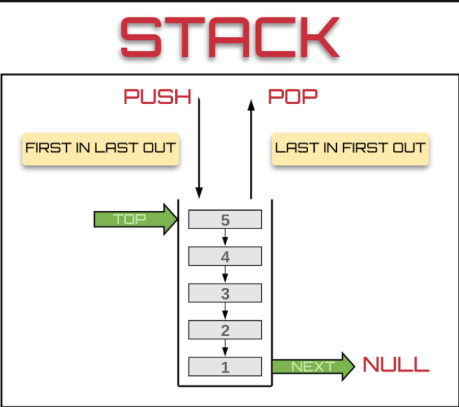
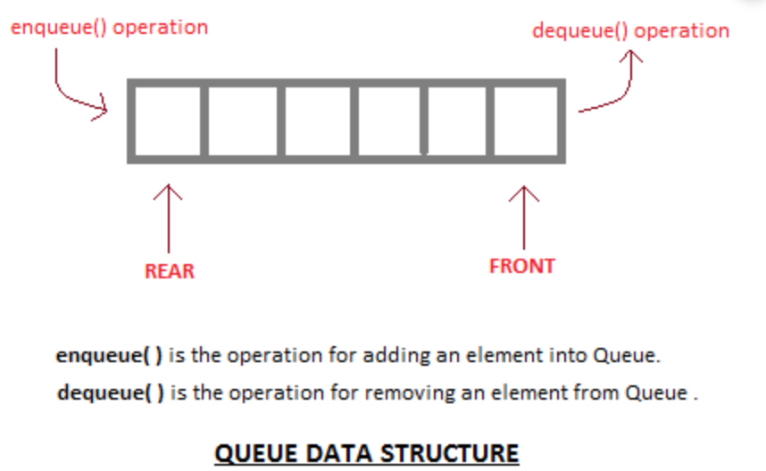
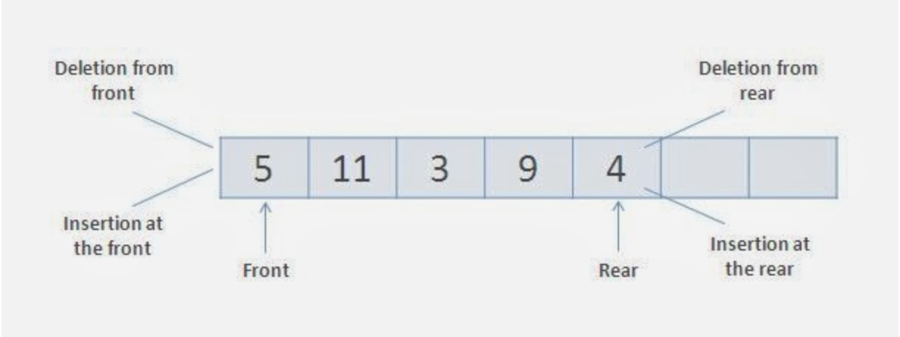
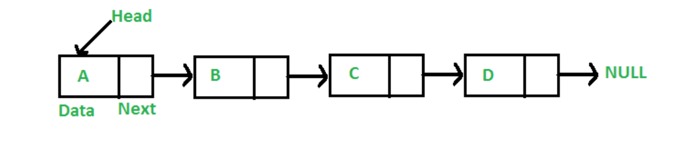

# Assessment 11: Data Structures and Algorithms

## Stacks

_**Stack** is a **Linear Data Structure** which follows a particular order in which the operations are performed. The order may be **LIFO**(Last In First Out) or **FILO**(First In Last Out). A real world stack allows operation at one end only. An example of Stack implementation is consider an example of plates stacked over one another in the canteen. The plate which is at the top is the first one to be removed, i.e. the plate which has been placed at the bottommost position remains in the stack for the longest period of time. So, it can be simply seen to follow **LIFO**(Last In First Out)/**FILO**(First In Last Out) order._ 

_The advanatges of **Stacks** are it provides a way for users to access different pieces of contiguous data in a Last In First Out manner. Stacks are easy to use and gurantee O(1) runtime for these 3 operations(E-Peek, E-Pop, E-Element)._ 

## Queues

_**Queues** is a **Linear Data Structure** which follows a particular order in which the operations are performed. The order is First In First Out **(FIFO)**. A good example of a queue is any queue of consumers for a resource where the consumer that came first is served first (Starbucks). The difference between stacks and queues is in removing. In a stack we remove the item the most recently added; in a queue, we remove the item the least recently added._

_The advantages are: it can basically have infinite length compared with the use of fixed-length arrays. It is fast and flexible . It can handle multiple data types. A queue allows for O(1) insertion from the end and O(1)deletion from the front._

## Deque

_A **Deque** also known as a double-ended queue, is an ordered collection of items similar to the queue. It has two ends, a front and a rear, and the items remain positioned in the collection. What makes a deque different is the unrestrictive nature of adding and removing items. New items can be added at either the front or the rear. Likewise, existing items can be removed from either end. In a sense, this hybrid linear structure provides all the capabilities of stacks and queues in a single data structure._ 

_The advantage of a **Deque**  are it can assume many of the characteristics of stacks and queues, it **does not** require the LIFO and FIFO orderings that are enforced by those data structures. It is up to you to make consistent use of the addition and removal operations._

## Linked Lists 

_A **Linked List** is a **linear data structure**, in which the elements are not stored at contiguous memory locations. In simple words, a linked list consists of nodes where each node contains a data field and a reference(link) to the next node in the list._

_The advantage of a **Linked List** are they can grow and shrink during run time. Insertion and Deletion Operations are Easier. Efficient Memory Utilization ,i.e no need to pre-allocate memory. Faster Access time,can be expanded in constant time without memory overhead. The runtime for a Linked List average is O(n) for (Acess and Search)_

## Hash Table 
