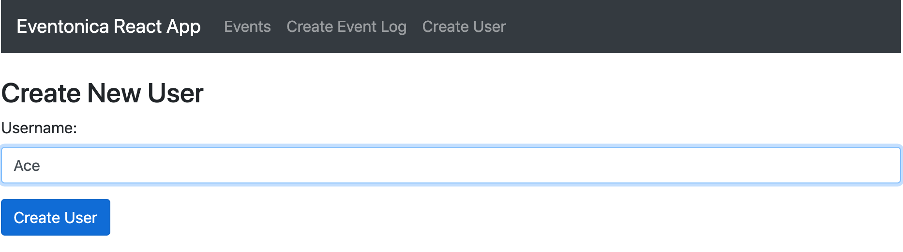
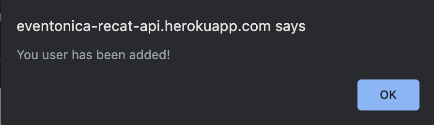
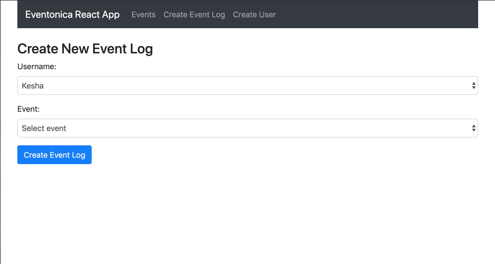
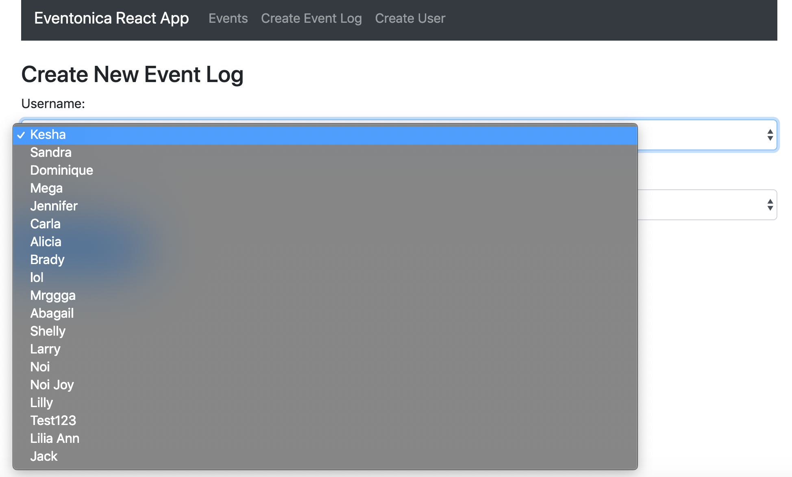
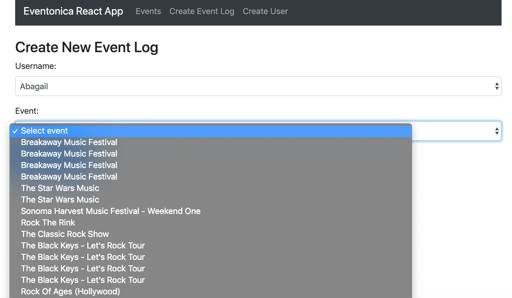
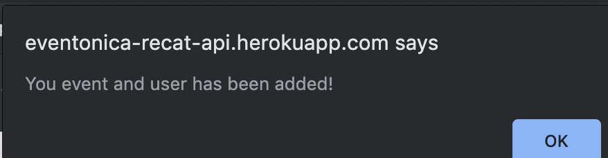
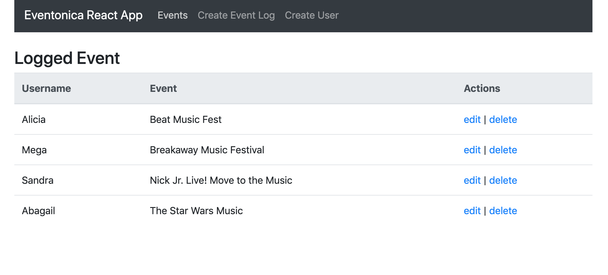

# EVENTONICA REACT

Made for the [eventonica-react](https://github.com/Techtonica/curriculum/blob/master/projects/eventonica-react.md) assignment and the [eventonica-assessment](https://github.com/Techtonica/curriculum/blob/master/projects/react-assessment.md)

click [here](https://eventonica-recat-api.herokuapp.com/)
 for live site

# BUILT WITH

* [Express.js](https://expressjs.com/)
* [React](https://reactjs.org/) 
* [MongoDB](https://www.mongodb.com)
* [Mongoose](https://mongoosejs.com/) 
* [Axios](https://www.npmjs.com/package/axios) 
* [Bootstrap](https://getbootstrap.com/) 
* [dotenv](https://www.npmjs.com/package/dotenv)
* [cors](https://www.npmjs.com/package/cors) 

## Available Scripts

In project directory, you can run:

### `nodemon server`

Runs the app on th backend and connects to MongoDB, 'cd' into 'eventonica-react' 
The server will run on Port||5000

### `npm start`

'cd' into 'client' Runs the app in the development mode. 
Open [http://localhost:3000](http://localhost:3000) to view it in the browser.

# APP IMAGES

 

 

 

 

 

 

# AUTHOR

Alicia
